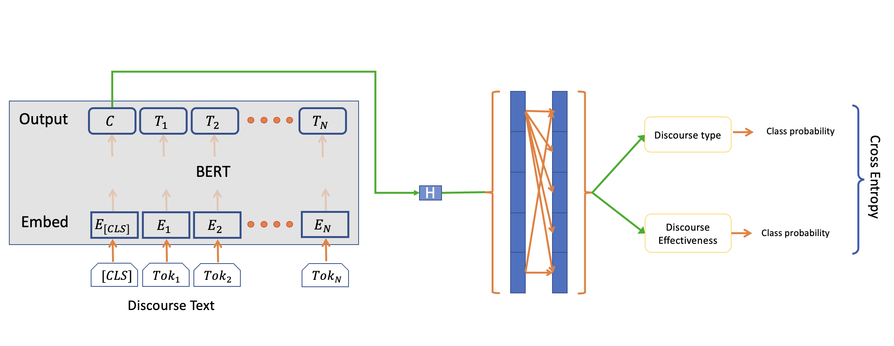

## Predicting Effective Arguments

### Introduction
Academic writing is a crucial part of life and the need to ensure students develop writing confidence and proficiency is pivotal.  Findings show that human tutoring is effective at improving students’ writing performance, but it is time consuming and labor intensive[1] . Over the years, Automated essay scoring (AES), and feedback has been gaining attention due to technological advances in educational assessment. 
AES systems such as Accessor, e-rater and Project Essay Grade[2], use linear regression and hand-crafted features such as proposition counts and length of essays. Other sophisticated AES are limited by cost, and they often fail to evaluate the quality of argumentative elements, such as organization, evidence, and idea development. Deep Learning-based models and word embeddings[3] are currently being explored to address these limitations.

### Problem Statement
Due to resource constraints and limitations especially in underrepresented communities, teachers’ ability to issue writing tasks and feedback to students are limited. We will train a model to classify argumentative elements in student writing as "effective," "adequate," or "ineffective”. Our [dataset](https://www.kaggle.com/competitions/feedback-prize-effectiveness)[4] contains about 36k paragraphs/excerpts extracted from 4191 essays written by U.S students in grades 6-12. Each excerpt is rated as "effective," "adequate," or "ineffective” and it belongs to one of the seven discourse elements - lead, position, claim, counterclaim, rebuttal, evidence and concluding statement. This will enable students get automated guidance and feedback on writing tasks and help them improve their writing skills.  

### Data Collection 
Our [dataset](https://www.kaggle.com/competitions/feedback-prize-effectiveness)[4] contains about 36k excerpt from essays written by U.S students in grades 6-12. 

In Fig. 1, we present a word cloud of the data to have an insight into the theme of the essays contained in the dataset. Through key words such as - student, classes, online, education e.t.c, we can conclude that the theme of the essays is on Eductaion.
    

**Fig.1.** Word cloud representation of the Essays in the dataset

**Characteristics of the dataset**
1. Size of dataset = (36765, 5)
2. Number of Essays = 4191
3. The dimensions of the data set includes; discourse_id, essay_id, discourse_text, discourse_type and discourse_effectiveness.
4. Each student essay is represented by the essay_ids, which the  discourse_ids are mapped to. The discourse_id is the unique classifier for each argument (discourse_text) to be classified. Each discourse_type corresponds to one of the seven discourse elements, and one of the discourse_effectiveness class - Effective, Adequate, and Ineffective. 

**Fig.2.** Displaying a few rows of our dataset 

5. It is important to note that the dataset is unbalanced. Out of the 36k discourse_ids, more than 20k are rated "adequate", whereas only 6k "ineffective" and 9k "effective" arguments exist (Displayed in Fig. 3). Such imbalanced training could bias the final model. Therefore, this inbalance in training is countered either by random oversampling for unsupervised learning, and through weighted loss function in supervised learrning. Results will be presented for balanced and unbalanced training.

**Fig.3** Distribution of the discourse_effectiveness class 

6. Additionally, The plot of the discourse_type shows that the arguments in the data set contains more Evidence and Claim based elements compared to the other discourse elements(Fig. 4).

**Fig.4** Distribution of the discourse_type

**Train and Test Data**
To build our model, we split the dataset into train and test data using an 80:20 split. The table below summarises the charactersitics of the train and test data with respect to the discourse_effectiveness classes. 

| Dataset    | Adequate  | Effective | Ineffective |
| ---------- | :-------: | :-------: |  :-------:  |
| Train      | 16768     | 7435      | 5209        |
| Test       | 4209      | 1891      | 1253        |

**Table 1.** Summary of the characteristics of the train and test data

In the following sections, we will explore these datasets in detail, and develop a model to classify arguments as effective, inadequate and ineffective.

### Methods
In this project, we attempt to predict these ratings through Supervised and Unsupervised learning methods. As this classification problem is based on textual inputs, we will use Natural Language Processing techniques to approach this problem.

**Supervised Learning Methods**  

1.	BERT[5] : We will use pretrained BERT embeddings with trainable hidden layers to obtain accurate classification of each essays 
2.	DeBERTa[6] :As a second method, we will use embeddings from the recenlty release model by Microsft - DeBERTa. It uses disentangled attention mechanism and an enhanced masked encoder to improve the accuracy of BERT. 
3.	Bidirectional GRU[7] :  We will use bidirectional GRUs to model the contexts from both directions, enabling the model to make a more informed decision for our task 

For BERT and DeBERTa, we will perform both single task and multi task learning.

1. Singl Task Learning (STL) : We will appened the discourse type with the discourse text and use that as the input to our NLP model and predict the effectiveness of the argument.
2. Multi Task Learning (MTL) : We will perform the following two tasks using a single model in hope of enhancing our model capability (Figure 4)
    1.  Predict the discourse type 
    2.  Predict the discourse effectiveness 

**Fig.4** Our Model for Multi Task Learning 

**Unsupervised Learning Methods**

This will be employed to identify patterns in the data and attribute labels a posteriori, to account for datasets without labels to guide the training process. This will be accomplished through One-hot encoding and BERT encodings.

* One-Hot encodings: For this analysis, we use Tf-idf (Term frequency - inverse document frequency) representation for each essay snippet. Considering each word in the dataset to be a dimension results in around 29k features for each data point. However, this large dimensional space includes due to mispellings and various forms of the same word, thus leading to redundant features. To reduce these reduntant features, the vocabulary (consequently the dimesions of the dataset) is limited only the words that are present in at least two different essays. Further, these words are lemmatized to their root word. Through these steps, the vector-space of the data is limited to 7795 dimensions. This vector-space is further reduced through dimensionality through PCA[10] and t-SNE[11] to select the dominant features of the dataset. Clustering in then performed in this reduced dimensional space using k-Means clustering [9] and Gaussian Mixture models (GMM).

* BERT encodings: Despite many dimensinality reductions and feature enginnering, one-hot encoding treats each word indivudually and cannot capture the semantic representation of the text. Therefore, BERT encoding are used to address this deficiency of one-hot encodings. Similar to the analysis using one-hot vectors, we extract dominant features using PCA and t-SNE, and reduce the dimensionility of the data. Then, clustering is performed using k-Means and GMM.

<!---
We also compare the effect of dimensionality reduction techniques before clustering through k-Means algorithm to understand the effect of word embeddings on the essay rating predictions, using :
    1. PCA[10]
    2. T-SNE[11]
--->

### Results and Discussion

<!--- ### Midterm Report Checkpoint --->

**1. Supervised learning: Results and Discussion** 

One of the issues with our dataset was that it was imbalanced. There were far more data points for "Adequate" class than the other two. We used the *WeightedSampler* in Pytorch in our data loader which samples the training data based on their frequency. We have presented results for STL and MTL with balanced and imbalanced datasets. Since we were using Google Colab for our training we could not load the full BERT model due to memoery issues. Therefore we used Distil BERT which removed the redundant parameters from BERT and still gives comparable performance. 

As discussed above, Single task learning (STL) and multitask learning (MTL) were implemented using both BERT and DeBERTa embeddings. We also developed a Bidirectional GRU model for Single Task Learning on Imbalanced Dataset.  In the multi-class classification for the three class arguments – Effective, Adequate and Ineffective, we compared precision, recall and f1 scores for STL and MTL models over balanced and imbalanced data sets. 

As expected, STL achives higher accuracy than MTL, and accuracy for models trainined imbalanced data has higher accuracy than a model trained on balanced data. Moreover DeBERTa embeddings gave a better performance over the BERT embeddings and BiGRU had the worst performance. (Summary is shown in table 1 below). 

<!---
overall performance improvement is achieved in the imbalanced data for both MTL and STL models compared to the results obtained with the balanced data set.(Summary is shown in table 2 below). 
--->
|Model used|Learning method | Balanced  | Imbalanced| 
|:--------:| ------------- | :-------: | :-------: | 
|BERT      |  STL          | 0.62      | 0.68      | 
|BERT      |  MTL          | 0.58      | 0.65      | 
|DeBERTa   |  STL          | 0.66      | 0.69      | 
|DeBERTa   |  MTL          | 0.64      | 0.67      | 
|BiGRU     |  STL          | -         | 0.60      | 

**Table 2: Summary of accuracy results for STL and MTL over balanced and unbalanced data sets using BERT, DeBERTA and BiGRU model.**

However, this superior performance is limited to majority class. For minority class like "ineffective", the imbalanced models have very poor performance (see recall in Table 3. a and 3. c in comparision to Table 3. b and Table 3. d respectively). Whereas, for the balanced data set, the performance scores were mostly consistent for both MTL and STL. Additionally, we see a distinction between STL and MTL models. In general, MTL models are more robust to imbalanced training. This is also reflected in the MTL model performance for imbalanced training - we see a more consistent performance across all labels ("adequate", "effective" and "ineffective) for MTL (Table 2. c) vis-a-vis STL performance (see Table 3.a). The performance metrics are summarized below in Table 3.

<table>
<tr><th> a. STL Imbalanced dataset (BERT) </th><th> b. STL Balanced dataset (BERT)</th></tr>
<tr><td>
    
|Labels         | Precision | Recall   | F1-score  | 
| ------------- | :-------: | :-------:| :-------: | 
| Ineffective   | 0.71      | 0.08     | 0.15      | 
| Adequate      | 0.67      | 0.90     | 0.77      | 
| Effective.    | 0.72      | 0.58     | 0.64      |   
| Macro avg.    | 0.70      | 0.52     | 0.52      | 
| Weighted  avg.| 0.69      | 0.68     | 0.63      | 

</td><td>

|Labels         | Precision | Recall    | F1-score |  
| ------------- | :-------: | :-------: | :-------:| 
| Ineffective   | 0.39      | 0.50      |0.44      | 
| Adequate      | 0.68      | 0.68      |0.68      | 
| Effective     | 0.70      | 0.57      |0.63      | 
| Macro avg.    | 0.59      | 0.58      |0.58      |
| Weighted  avg.| 0.64      | 0.62      |0.62      | 
    
</td></tr> </table>

<table>
<tr><th> c. MTL Imbalanced dataset (BERT) </th><th> d. MTL Balanced dataset (BERT)</th></tr>
<tr><td>
              
|Labels         | Precision | Recall   | F1-score  | 
| ------------- | :-------: | :-------:| :-------: | 
| Ineffective   | 0.46      | 0.26     | 0.33      | 
| Adequate      | 0.66      | 0.83     | 0.74      | 
| Effective     | 0.71      | 0.53     | 0.61      | 
| Macro avg.    | 0.61      | 0.54     | 0.56      | 
| Weighted  avg.| 0.64      | 0.65     | 0.63      | 

</td><td>
              
|Labels         | Precision | Recall   | F1-score  | 
| ------------- | :-------: | :-------:| :-------: | 
| Ineffective   | 0.38      | 0.52     | 0.44      | 
| Adequate      | 0.73      | 0.50     | 0.60      | 
| Effective     | 0.55      | 0.79     | 0.65      | 
| Macro avg.    | 0.55      | 0.61     | 0.56      | 
| Weighted  avg.| 0.62      | 0.58     | 0.58      | 
    
</td></tr> </table>

<table>
<tr><th> e. STL Imbalanced dataset (DeBERTa)</th><th> f. STL Balanced dataset (DeBERTa)</th></tr>
<tr><td>
    
|Labels         | Precision | Recall   | F1-score  | 
| ------------- | :-------: | :-------:| :-------: | 
| Ineffective   | 0.55      | 0.29     | 0.38      | 
| Adequate      | 0.68      | 0.85     | 0.76      | 
| Effective.    | 0.76      | 0.57     | 0.65      |   
| Macro avg.    | 0.66      | 0.57     | 0.60      | 
| Weighted  avg.| 0.68      | 0.69     | 0.67      | 

</td><td>

|Labels         | Precision | Recall    | F1-score |  
| ------------- | :-------: | :-------: | :-------:| 
| Ineffective   | 0.47      | 0.39      |0.42      | 
| Adequate      | 0.67      | 0.80      |0.73      | 
| Effective     | 0.76      | 0.51      |0.61      | 
| Macro avg.    | 0.63      | 0.57      |0.59      |
| Weighted  avg.| 0.66      | 0.66      |0.65      | 
    
</td></tr> </table>

<table>
<tr><th> g. MTL Imbalanced dataset (DeBERTa) </th><th> h. MTL Balanced dataset (DeBERTa) </th></tr>
<tr><td>
              
|Labels         | Precision | Recall   | F1-score  | 
| ------------- | :-------: | :-------:| :-------: | 
| Ineffective   | 0.56      | 0.15     | 0.23      | 
| Adequate      | 0.68      | 0.82     | 0.75      | 
| Effective     | 0.66      | 0.68     | 0.67      | 
| Macro avg.    | 0.63      | 0.55     | 0.55      | 
| Weighted  avg.| 0.66      | 0.67     | 0.64      | 

</td><td>
              
|Labels         | Precision | Recall   | F1-score  | 
| ------------- | :-------: | :-------:| :-------: | 
| Ineffective   | 0.43      | 0.36     | 0.39      | 
| Adequate      | 0.70      | 0.70     | 0.70      | 
| Effective     | 0.62      | 0.68     | 0.65      | 
| Macro avg.    | 0.58      | 0.58     | 0.58      | 
| Weighted  avg.| 0.63      | 0.64     | 0.63      | 
    
</td></tr> </table>

**Table 3(a-h): Summary of precision, recall and F1-scores for STL and MTL over balanced and imbalanced data sets for BERT and DeBERTA.**

**Note:**
1. Precision: TP/(TP+FP) -  indicates  what fraction of predictions as a positive class were actually positive.	
2. Recall: TP/(TP+FN) - indicates the fraction of all positive samples were correctly predicted as positive by the classifier.
3. f1_score: 2*(Precision.Recall)/(Precision + Recall) -is the harmonic mean of Precision and Recall. Research has shown that the F1 score is a better performance metrics than accuracy score for highly imbalanced datasets. 

Overall, MTL and balanced training improved the robustness of the predictions across the classes and thus generalize the model better for all classes. As a trade-off, we loose some accuracy in both these approaches - MTL is seen to trade more accuracy than balanced training to improve robustness.

<!---
Although the overall accuracy was lower for MTL models, we see noticeable performance improvements in the adequate and effective labels where the MTL performed better for precision and recall scores respectively.

For the imbalanced data set, the recall and f1-scores improved with MTL compared to the STL as expected, but performed lower for precision. (Report summary is shown in table 2(a-d)).
--->

**2. Unsupervised learning: Results and Discussion**

We use the same metrics (precision, recall, and F1) used to evaluate supervised learning. Here, the essay discourse information is converted to a one-hot encoding and concatenated to the Tf-idf vector prior to dimensionality reduction. Results for PCA-based feature selection and t-SNE based feature selection are presented next. To perform model selection, the dataset was split 20-80 across the validation and training datasets.  

* **PCA + Tf-Idf vectorization**

In order to obtain usable feature vectors as input to unsupervised clustering methods (e.g. KMeans), the Tf-Idf encoded vectors were reduced by many magnitudes using PCA. A variance of at least 50% was retained by the reduced feature vectors. Multiple PCA feature dimensions were tested with GMM and KMeans clustering algorithm to find the optimal model. The results are tabluated below:

<table>
<tr><th> a. PCA + Tf-Idf Balanced dataset GMM </th><th> b. PCA + Tf-Idf Balanced dataset Kmeans  </th></tr>
<tr><td>
              
|Labels         | Precision | Recall   | F1-score  | 
| ------------- | :-------: | :-------:| :-------: | 
| Ineffective   | 0.29      | 0.55     | 0.38      |
| Adequate      | 0.68      | 0.34     | 0.46      |  
| Effective     | 0.39      | 0.59     | 0.47      | 
| Macro avg.    | 0.45      | 0.50     | 0.44      | 
| Weighted  avg.| 0.54      | 0.44     | 0.45      | 

</td><td>
              
|Labels         | Precision | Recall   | F1-score  | 
| ------------- | :-------: | :-------:| :-------: | 
| Ineffective   | 0.30      | 0.55     | 0.39      |
| Adequate      | 0.67      | 0.40     | 0.50      | 
| Effective     | 0.39      | 0.52     | 0.45      | 
| Macro avg.    | 0.45      | 0.49     | 0.45      | 
| Weighted  avg.| 0.54      | 0.46     | 0.47      | 
    
</td></tr> </table>
<table>
<tr><th> c. PCA + Tf-Idf Unbalanced dataset GMM </th><th> d. PCA + Tf-Idf Unbalanced dataset Kmeans  </th></tr>
<tr><td>
              
|Labels         | Precision | Recall   | F1-score  | 
| ------------- | :-------: | :-------:| :-------: | 
| Ineffective   | 0.36      | 0.02     | 0.04      | 
| Adequate      | 0.60      | 0.89     | 0.72      | 
| Effective     | 0.49      | 0.27     | 0.35      | 
| Macro avg.    | 0.48      | 0.39     | 0.37      | 
| Weighted  avg.| 0.53      | 0.58     | 0.51      | 

</td><td>
              
|Labels         | Precision | Recall   | F1-score  | 
| ------------- | :-------: | :-------:| :-------: | 
| Ineffective   | 0.50      | 0.02     | 0.03      | 
| Adequate      | 0.60      | 0.92     | 0.72      | 
| Effective     | 0.52      | 0.23     | 0.32      | 
| Macro avg.    | 0.54      | 0.39     | 0.36      | 
| Weighted  avg.| 0.56      | 0.59     | 0.50      | 
        
</td></tr> </table>

**Table 4 a-d: Summary of metrics for PCA + Tf-Idf balanced and unbalanced datasets with GMM and Kmeans clustering for 100 Clusters and 75 features**

From these experiments, we see that 100 KMeans clusters on 75 PCA features achieves the best performance of 44% accuracy on the validation dataset. As mentioned in the Data Collection section, we observed the dataset to be biased towards one label value (Adequate), which caused the model to assign most clusters to this value. To counter this bias, we oversample the non-majority data using *RandomOverSampling* of *imblearn* module and create multiple samples the under-represented labels. This reduces the bias towards the majority label (Adequate).

<!---
Using KMeans, we were able to achieve an accuracy rate of around 44% with the data that was provided by the Kaggle challenge. As mentioned in the Data Collection section, we observed the dataset to be biased towards one label value (Adequate), which caused the model to assign most clusters to this value. To counter this bias, we balanced the data by oversampling the data, creating multiple samples of the other label values, and reducing the dominating label (Adequate). This in turn increased the accuracy of the model to 44% on the validation set. 
--->

Additionally, rather than creating just three clusters, and mapping each cluster of KMeans to a label value, we generated multiple clusters, and assigned each cluster to a label value. This decreases the chances of grouping too many datapoints and assigning a single label to a big chunk of data, and increases the likelihood of assigning smaller groups of datapoints within the larger cluster to the correct label. This method of clustering proved ineffective for the unbalanced data as most clusters were assigned to the dominating label, but worked well with the balanced data set. The model was tested using a validation dataset which was extracted from the original dataset. The table below shows the metrics achieved using the mehtods described above.

* **PCA + BERT vectorization**

Similar experiement was repeated using BERT encodings in place of Tf-Idf vectors. Note that the output of BERT gives an encoding for each word/token in the input in addition to the overall document level encoding. Since we want to evaluate the overall effectiveness of the whole document rather than a single word, we use BERT encoding corresponding to the CLS token and discard all other encodings. Just as in the case of Tf-Idf vectors, the number of PCA features and clusters are varied. The performance metrics on the validation data are listed below:

<table>
<tr><th> a. PCA + BERT Balanced dataset GMM </th><th> b. PCA + BERT Balanced dataset Kmeans  </th></tr>
<tr><td>
              
|Labels         | Precision | Recall   | F1-score  | 
| ------------- | :-------: | :-------:| :-------: | 
| Ineffective   | 0.34      | 0.57     | 0.43      |
| Adequate      | 0.68      | 0.43     | 0.53      |  
| Effective     | 0.45      | 0.62     | 0.52      | 
| Macro avg.    | 0.49      | 0.54     | 0.49      | 
| Weighted  avg.| 0.56      | 0.50     | 0.51      | 

</td><td>
             
|Labels         | Precision | Recall   | F1-score  | 
| ------------- | :-------: | :-------:| :-------: | 
| Ineffective   | 0.34      | 0.60     | 0.43      |
| Adequate      | 0.69      | 0.38     | 0.49      |  
| Effective     | 0.45      | 0.67     | 0.54      | 
| Macro avg.    | 0.49      | 0.55     | 0.49      | 
| Weighted  avg.| 0.57      | 0.49     | 0.49      | 
   
</td></tr> </table>
<table>
<tr><th> c. PCA + BERT Unbalanced dataset GMM </th><th> d. PCA + BERT Unbalanced dataset Kmeans  </th></tr>
<tr><td>
              
|Labels         | Precision | Recall   | F1-score  | 
| ------------- | :-------: | :-------:| :-------: | 
| Ineffective   | 0.53      | 0.11     | 0.18      | 
| Adequate      | 0.62      | 0.87     | 0.72      | 
| Effective     | 0.57      | 0.35     | 0.43      | 
| Macro avg.    | 0.57      | 0.44     | 0.45      | 
| Weighted  avg.| 0.59      | 0.61     | 0.56      | 

</td><td>
              
|Labels         | Precision | Recall   | F1-score  | 
| ------------- | :-------: | :-------:| :-------: | 
| Ineffective   | 0.53      | 0.08     | 0.14      | 
| Adequate      | 0.62      | 0.88     | 0.73      | 
| Effective     | 0.59      | 0.36     | 0.45      | 
| Macro avg.    | 0.58      | 0.44     | 0.44      | 
| Weighted  avg.| 0.60      | 0.61     | 0.56      | 
        
</td></tr> </table>

**Table 5 a-d: Summary of metrics for PCA + BERT balanced and unbalanced datasets with GMM and Kmeans clustering for 100 Clusters and 25 features**

From these experiments, we see that BERT encoding perform better than Tf-Idf encodings in all metrics: F1 score, precision, recall and accuracy. The best BERT encoding based model obtains 25 PCA features from 768-dimensional BERT encodings and then cluster the PCA features into 100 clusters through KMeans. This gives 49% accuracy on the validation data.

<!---

<table>
<tr><th> Training Metrics for 75 features with 15 clusters</th><th> Validation Metrics for 75 features with 15 clusters
<tr><td>

    
|Labels         | Precision | Recall   | F1-score  | 
| ------------- | :-------: | :-------:| :-------: | 
| Adequate      | 0.40      | 0.56     | 0.46      | 
| Ineffective   | 0.52      | 0.46     | 0.49      | 
| Effective     | 0.51      | 0.36     | 0.42      |   
| Macro avg.    | 0.47      | 0.46     | 0.46      | 
| Weighted  avg.| 0.47      | 0.46     | 0.46      | 
    
</td><td>

|Labels         | Precision | Recall    | F1-score |  
| ------------- | :-------: | :-------: | :-------:| 
| Adequate      | 0.63      | 0.55      | 0.59     | 
| Ineffective   | 0.30      | 0.46      | 0.36     | 
| Effective     | 0.38      | 0.36      | 0.37     | 
| Macro avg.    | 0.44      | 0.45      | 0.44     |
| Weighted  avg.| 0.51      | 0.48      | 0.49     | 
    
</td></tr> </table>
    
**Table 4: Summary of precision, recall and F1-scores for KMeans using PCA reduced feature vectors of balanced data set.**
    
Alternatively, we attempted to execute the KMeans algorithm with 3 clusters (the amount of label values), and forcefully assigned each cluster to one of the three label values. However, this proved ineffective as the model struggled to achieve 40% accuracy. In addition, it seems dimensionality reduction doesn’t affect the assignment of data points to the three clusters. We tested reducing the feature vector to various number of features (75, 100, 200, etc.), and found that clustering was not affected. The accuracy remained 39% as shown in the table below.

<table>
<tr><th> Training Metrics for any number of features with 3 clusters</th><th> Validation Metrics for any number of features with 3 clusters
<tr><td>

|Labels         | Precision | Recall   | F1-score  | 
| ------------- | :-------: | :-------:| :-------: | 
| Adequate      | 0.38      | 0.37     | 0.38      | 
| Ineffective   | 0.45      | 0.48     | 0.46      | 
| Effective     | 0.39      | 0.37     | 0.38      |   
| Macro avg.    | 0.41      | 0.41     | 0.41      | 
| Weighted  avg.| 0.41      | 0.41     | 0.41      | 
    
</td><td>

|Labels         | Precision | Recall    | F1-score |  
| ------------- | :-------: | :-------: | :-------:| 
| Adequate      | 0.63      | 0.38      | 0.47     | 
| Ineffective   | 0.26      | 0.50      | 0.34     | 
| Effective     | 0.27      | 0.36      | 0.31     | 
| Macro avg.    | 0.39      | 0.41      | 0.47     |
| Weighted  avg.| 0.48      | 0.39      | 0.41     | 
    
</td></tr> </table>

**Table 5: Summary of metrics for any number of reduced features using PCA, and 3 clusters using balanced data set.**
--->
   
* **t-SNE**

PCA provides only linear combinaton of input fetaures, which may not be effective if the data has nonlinear variation. To account for the nonlinearity in data, we use t-SNE to reduce the high-dimensional encoding space into 2-3 components. Unlike PCA, t-SNE is computationally quite intensive, and we had to limit to the experiements to 3 features. As in the PCA-based experiments, we trained the models on balanced and imabalanced data sets, with GMM and KMeans clustering, and BERT and Tf-Idf vectorizations. 

* **t-SNE + Tf-Idf encoding**

The performance metrics on the validation data are given below:

<table>
<tr><th> a. t-SNE + Tf-Idf Balanced dataset GMM </th><th> b. t-SNE + Tf-Idf Balanced dataset Kmeans  </th></tr>
<tr><td>
              
|Labels         | Precision | Recall   | F1-score  | 
| ------------- | :-------: | :-------:| :-------: | 
| Ineffective   | 0.31      | 0.61     | 0.41      |
| Adequate      | 0.67      | 0.32     | 0.44      |  
| Effective     | 0.43      | 0.63     | 0.52      | 
| Macro avg.    | 0.47      | 0.54     | 0.46      | 
| Weighted  avg.| 0.55      | 0.48     | 0.45      | 

</td><td>
              
|Labels         | Precision | Recall   | F1-score  | 
| ------------- | :-------: | :-------:| :-------: | 
| Ineffective   | 0.29      | 0.53     | 0.37      |
| Adequate      | 0.64      | 0.34     | 0.45      | 
| Effective     | 0.34      | 0.51     | 0.41      | 
| Macro avg.    | 0.42      | 0.46     | 0.41      | 
| Weighted  avg.| 0.51      | 0.42     | 0.43      | 
    
</td></tr> </table>
<table>
<tr><th> c. t-SNE + Tf-Idf Unbalanced dataset GMM </th><th> d. t-SNE + Tf-Idf Unbalanced dataset Kmeans  </th></tr>
<tr><td>
              
|Labels         | Precision | Recall   | F1-score  | 
| ------------- | :-------: | :-------:| :-------: | 
| Ineffective   | 0.48      | 0.06     | 0.11      | 
| Adequate      | 0.61      | 0.90     | 0.72      | 
| Effective     | 0.52      | 0.26     | 0.35      | 
| Macro avg.    | 0.53      | 0.41     | 0.39      | 
| Weighted  avg.| 0.56      | 0.59     | 0.52      | 

</td><td>
              
|Labels         | Precision | Recall   | F1-score  | 
| ------------- | :-------: | :-------:| :-------: | 
| Ineffective   | 0.48      | 0.11     | 0.18      | 
| Adequate      | 0.61      | 0.89     | 0.72      | 
| Effective     | 0.51      | 0.23     | 0.32      | 
| Macro avg.    | 0.53      | 0.41     | 0.41      | 
| Weighted  avg.| 0.56      | 0.59     | 0.53      | 
        
</td></tr> </table>

**Table 6 a-d: Summary of metrics for t-SNE+ Tf-Idf balanced and unbalanced datasets with GMM and Kmeans clustering for 100 Clusters and 3 features**

* **t-SNE + BERT encoding**

Similar to the PCA based analysis on BERT encodings, only the CLS token's encoding (768-dimensional) is considered in this analysis. The results are 

<table>
<tr><th> a. t-SNE + BERT Balanced dataset GMM </th><th> b. t-SNE + BERT Balanced dataset Kmeans  </th></tr>
<tr><td>
              
|Labels         | Precision | Recall   | F1-score  | 
| ------------- | :-------: | :-------:| :-------: | 
| Ineffective   | 0.32      | 0.60     | 0.42      |
| Adequate      | 0.70      | 0.36     | 0.48      |  
| Effective     | 0.44      | 0.67     | 0.53      | 
| Macro avg.    | 0.49      | 0.55     | 0.48      | 
| Weighted  avg.| 0.57      | 0.48     | 0.48      | 

</td><td>
              
|Labels         | Precision | Recall   | F1-score  | 
| ------------- | :-------: | :-------:| :-------: | 
| Ineffective   | 0.33      | 0.55     | 0.41      |
| Adequate      | 0.68      | 0.37     | 0.48      | 
| Effective     | 0.43      | 0.67     | 0.53      | 
| Macro avg.    | 0.48      | 0.53     | 0.47      | 
| Weighted  avg.| 0.56      | 0.48     | 0.48      | 
    

</td></tr> </table>
<table>
<tr><th> c. t-SNE + BERT Unbalanced dataset GMM </th><th> d. t-SNE + BERT Unbalanced dataset Kmeans  </th></tr>
<tr><td>
    
|Labels         | Precision | Recall   | F1-score  | 
| ------------- | :-------: | :-------:| :-------: | 
| Ineffective   | 0.56      | 0.12     | 0.19      | 
| Adequate      | 0.63      | 0.88     | 0.73      | 
| Effective     | 0.60      | 0.37     | 0.46      | 
| Macro avg.    | 0.59      | 0.46     | 0.46      | 
| Weighted  avg.| 0.61      | 0.62     | 0.57      | 

</td><td>
              
|Labels         | Precision | Recall   | F1-score  | 
| ------------- | :-------: | :-------:| :-------: | 
| Ineffective   | 0.53      | 0.09     | 0.15      | 
| Adequate      | 0.62      | 0.87     | 0.73      | 
| Effective     | 0.59      | 0.39     | 0.47      | 
| Macro avg.    | 0.58      | 0.45     | 0.45      | 
| Weighted  avg.| 0.60      | 0.62     | 0.56      | 
        

</td><td>
</table>
    
**Table 7 a-d: Summary of metrics for t-SNE+ BERT balanced and unbalanced datasets with GMM and Kmeans clustering for 100 Clusters and 2 features**

From these experiements we see that balanced learning performs better than models trained on imbalanced data sets. Also, models based on BERT encodings outperform Tf-Idf encodings based models. This is to be expected because the BERt encodings retain the semantic information of the documents. Whereas, Tf-Idf tokens are independentl of each other thus lack any semantic and sequential information. 

An interesting observation is that for PCA-based models both clustering performance of KMeans and GMM is very similar (see Tables 4 and 5). However, on t-SNE features GMM is seen to have better clustering performance than KMeans (see Tables 6 and 7). This can be explained from the orthogonal nature of the PCA modes. As the PCA modes are uncorrelated, the Euclidian distance metric used in KMeans accurately captures the clonesness between the data points. In contrast, the t-SNE modes are typically correlated to each other. Due to this, the full matrix covariance of GMM captures the proximity between the data points better. Thus, we see that GMM performs better than KMeans on t-SNE based models while their performance is similar on PCA-based models.

The accuray and performance metrics of the top 4 unsupervised models are listed below in Table **8** for summary. 

<th>   accuray and performance metrics of the top 4 unsupervised models   </th>
              
|Labels         | Accuracy |
| ------------- | :------: | 
| Tf-Idf+PCA    | 0.46     | 
| BERT+PCA      | 0.49     |
| Tf-Idf+t-SNE  | 0.46     | 
| BERT+t-SNE    | 0.48     |

 </table>
 
 **Table 8: Accuracy and Performance metrics of the top 4 Unsupervised Models**

To conclude, among the unsupervised learning models considered, the balanced learning model with 25 features and 100 K-means clusters using BERT+PCA (Table **5 a**) is seen to provide the best mix of accuracy and generalization across classes. 

<!---
We used t-SNE to reduce the dimensions to 3 components (i.e. 3d Projection of data). The imbalanced dataset could not get a stable response and the performance was poor for a number of clusters 3,5,15 and 25. It can be inferred from tables 6-a and 6-b, that there is a noticeable difference between the performances of the unbalanced dataset and balanced dataset for the same number of clusters in Kmeans. The performances of effective and ineffective labeling increases as the number of clusters increase in the balanced dataset. The balanced data has significant performance improvement from 10 to 25 clusters as seen in tables 6-c and 6-d, but the performance does not increase after and stagnates at the same level as the number of clusters keep increasing.

<table>
<tr><th> a. Imbalanced dataset for 3 Clusters</th><th> b. Balanced dataset for 3 clusters</th></tr>
<tr><td>

    
|Labels         | Precision | Recall   | F1-score  | 
| ------------- | :-------: | :-------:| :-------: | 
| Effective     | 0.00      | 0.00     | 0.00      | 
| Adequate      | 0.58      | 1.00     | 0.73      | 
| Ineffective   | 0.00      | 0.00     | 0.00      |   
| Macro avg.    | 0.19      | 0.33     | 0.24      | 
| Weighted  avg.| 0.33      | 0.58     | 0.42      | 

</td><td>

|Labels         | Precision | Recall    | F1-score |  
| ------------- | :-------: | :-------: | :-------:| 
| Effective     | 0.29      | 0.38      | 0.33     | 
| Adequate      | 0.60      | 0.38      | 0.46     | 
| Ineffective   | 0.24      | 0.42      | 0.30     | 
| Macro avg.    | 0.38      | 0.39      | 0.37     |
| Weighted  avg.| 0.46      | 0.39      | 0.40     | 
    
</td></tr> </table>

<table>
<tr><th> c. Balanced dataset for 10 Clusters</th><th> d. Balanced dataset for 25 Clusters</th></tr>
<tr><td>
              
|Labels         | Precision | Recall   | F1-score  | 
| ------------- | :-------: | :-------:| :-------: | 
| Effective     | 0.30      | 0.54     | 0.38      | 
| Adequate      | 0.62      | 0.28     | 0.39      | 
| Ineffective   | 0.27      | 0.44     | 0.33      | 
| Macro avg.    | 0.40      | 0.42     | 0.37      | 
| Weighted  avg.| 0.48      | 0.37     | 0.38      | 

</td><td>
              
|Labels         | Precision | Recall   | F1-score  | 
| ------------- | :-------: | :-------:| :-------: | 
| Effective     | 0.46      | 0.58     | 0.51      | 
| Adequate      | 0.48      | 0.41     | 0.44      | 
| Ineffective   | 0.51      | 0.44     | 0.47      | 
| Macro avg.    | 0.48      | 0.48     | 0.47      | 
| Weighted  avg.| 0.48      | 0.48     | 0.47      | 
    
</td></tr> </table>

**Table 6(a-d): Summary of precision, recall and F1-scores for TSNE for 3 components over balanced and unbalanced data sets.**

In terms of accuracy, we see that imbalanced training has higher accuracy than that of balanced training, and it is for all choice of clusters (see Table 5). This is due to the fact that in imbalanced models, all the data points are classified as the majority class. This is seen from the F1-score of zero for "ineffective" and "effective" classes in Table 6. a. In effect, the model has not decipher/learned the difference between the classes, but instead it undefits the data to the majority class.

We address this by balancing the training data through random-oversampling. In this process, similar to supervised learning, we trade-off accuracy for robust/consistent performance across all classes. This explains the drop in accuracy for balanced models in Table 7.

*prev comment-begin*
The accuracy of the reduced data over various clusters is given in table 4. It is worth noting that the accuracy for imbalanced dataset has only one cluster and is not able to label the other two clusters. The accuracy remains same as the number of clusters increase. The accuracy for balanced data set dropped a little and increased tremendously as the number of clusters were increased.
*prev comment-end*
    
     
|Number of Clusters | Balanced-OneHot | Imbalanced-OneHot | Balanced-BERT | Imbalanced-BERT | 
| ----------------- | :-------------: | :---------------: | :-----------: | :-------------: |
| 3                 | 0.39            | 0.58              | 0.37          | 0.57            |
| 15                | 0.38            | 0.58              | 0.39          | 0.58            |
| 25                | 0.48            | 0.58              | 0.49          | 0.60            |

**Table 7: Summary of accuracy results for t-SNE dimension reduced over balanced and imbalanced data sets.**

|Number of Clusters | Balanced-OneHot | Imbalanced-OneHot | Balanced-BERT | Imbalanced-BERT | 
| ----------------- | :-------------: | :---------------: | :-----------: | :-------------: |
| 3                 | 0.37            | 0.58              | 0.37          | 0.58            |
| 15                | 0.38            | 0.58              | 0.43          | 0.57            |
| 25                | 0.44            | 0.58              | 0.49          | 0.61            |
    
**Table 8: Summary of accuracy results for t-SNE dimension reduced over balanced and imbalanced data sets.**
    
To conclude, among the unsupervised learning models considered, the balanced learning model with 25 clusters (Table 6. d) is seen to provide the best mix of accuracy and generalization across classes. 
--->

### Conclusion and Future Work

As the education sector continues to dive deeper into automated evaluation systems, opportunities exists for the incorporation of automated essay feedback tools. In this report, we explored the applications of machine learning techniques in giving automated feedback to arguments in students essays, by classifying them as effective, adequate and ineffective. We gained insghts into the accuracies of supervised and unspervised learning methods.

* **Model Summary**

As expected supervised learning models provided higher accuracy than unsupervised methods. Within supervised methods, owing to abbility to better represent semantic information, DeBERTa based models performed better. The single tas model training on imbalanced data has the highest F1 score and accuracy. However, this model performs poorly at predicting the minority class "*ineffective*". Training the same DeBERTa model on balanced dataset through multi-task learning results in a robust performance across all classes. However, this comes at the expense of a drop in overall accuracy and F1 score.

Amongst the unsupervised models, reducing the BERT encodings through PCA (into 25 features) and obtaining clusters via KMeans (100 clusters) provided the best accuracy and F1 score across all classes. Interestly, the unsupervised model is more robust across the classes albeit with a poorer performance.

* **Future Research**
In a future study, one could explore improving the multi-task DeBERTa based model. Currently, the *BalancedSampler* only balances the *discourse_effectiveness* class. Extending the balanced sampling to *discourse_type* could improve the robustness of the model. Additionally, in the current multi-task learning architecture, only the last *soft-max* layer weights are varied for their specific tasks - rest of the weight are training jointly. Adding a few more independent layers for each of the task heads (particularly for *discourse_effectiveness* prediction), could improve both the accuracy and robustness of the supervised model.

For unsupervised models, we reduced the BERT encoding directly into a low dimensional space and then cluster the data. However, kernel methods such as kernel-PCA and spectral clustering cast the 768-dimensional dense representation of BERT encodings into a sparse infinite dimensional space and then perform dimensionality reduction. This could help indentify the basis that better clusters the data.

Overall, the current investigation serves as a good baseline for all future improvements, and specific directions to improve the perforamnce are also clearly indentified.

<!---
AES is widely being explored for essay writings in the education sector, and it can also be potentially explored in areas where where writing plays a major part such as in publishing, journalism, Law e.t.c 
--->

    
### Gantt Chart 

The Gantt chart for our project can be found [here](https://gtvault-my.sharepoint.com/:x:/g/personal/sjain443_gatech_edu/EVY1kVoq6ixHlA6FHNfmD4wBotXA6n20QsYxsModKdRhPA?e=2YC7zb&isSPOFile=1)

### References

[1]	C. Lu and M. Cutumisu, “Integrating deep learning into an automated feedback generation system for automated essay scoring,” Eric.ed.gov. [Online]. Available: https://files.eric.ed.gov/fulltext/ED615567.pdf. [Accessed: 11-Jun-2022].\
[2]	E. B. Page, “Computer grading of student prose, using modern concepts and software,” The Journal of Experimental Education, vol. 62, no. 2, pp. 127–142, 1994.\
[3]	K. Taghipour and H. T. Ng, “A neural approach to automated essay scoring,” in Proceedings of the 2016 Conference on EMNLP, 2016, pp. 1882–1891.\
[4]	Feedback Prize - Predicting Effective Arguments, link : https://www.kaggle.com/competitions/feedback-prize-effectiveness\
[5]	Devlin, Jacob, et al. "Bert: Pre-training of deep bidirectional transformers for language understanding." arXiv preprint arXiv:1810.04805 (2018).\
[6]	He, Pengcheng, et al. "Deberta: Decoding-enhanced bert with disentangled attention." arXiv preprint arXiv:2006.03654 (2020).\
[7]	Cho, Kyunghyun, et al. "On the properties of neural machine translation: Encoder-decoder approaches." arXiv preprint arXiv:1409.1259 (2014).\
[8]	Zhang, Jingqing, et al. "Pegasus: Pre-training with extracted gap-sentences for abstractive summarization." International Conference on Machine Learning. PMLR, 2020.\
[9]	Forgy, Edward W. "Cluster analysis of multivariate data: efficiency versus interpretability of classifications." biometrics 21 (1965): 768-769.\
[10]	Pearson, Karl. "LIII. On lines and planes of closest fit to systems of points in space." The London, Edinburgh, and Dublin philosophical magazine and journal of science 2.11 (1901): 559-572.\
[11]	Van Der Maaten, Laurens. "Accelerating t-SNE using tree-based algorithms." The journal of machine learning research 15.1 (2014): 3221-3245.\
[12] Y. Zhang and Q. Yang, “A Survey on Multi-Task Learning,” arXiv [cs.LG], 2017. \

